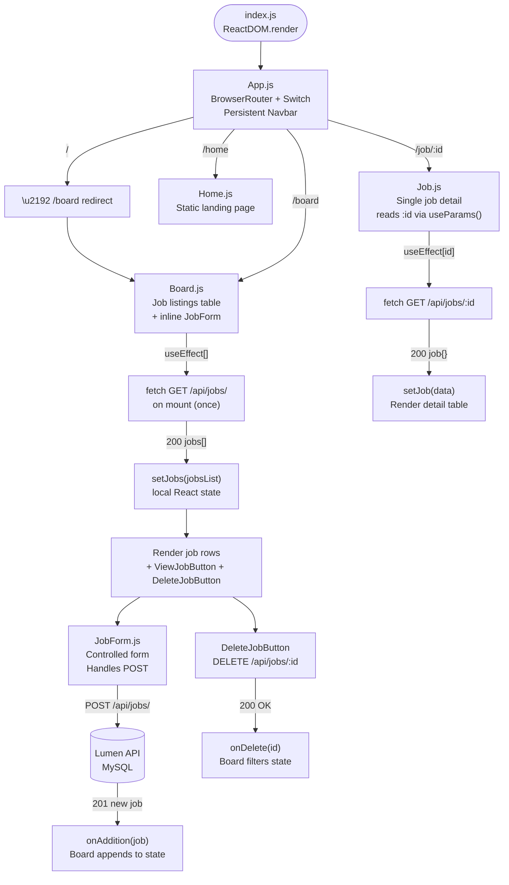
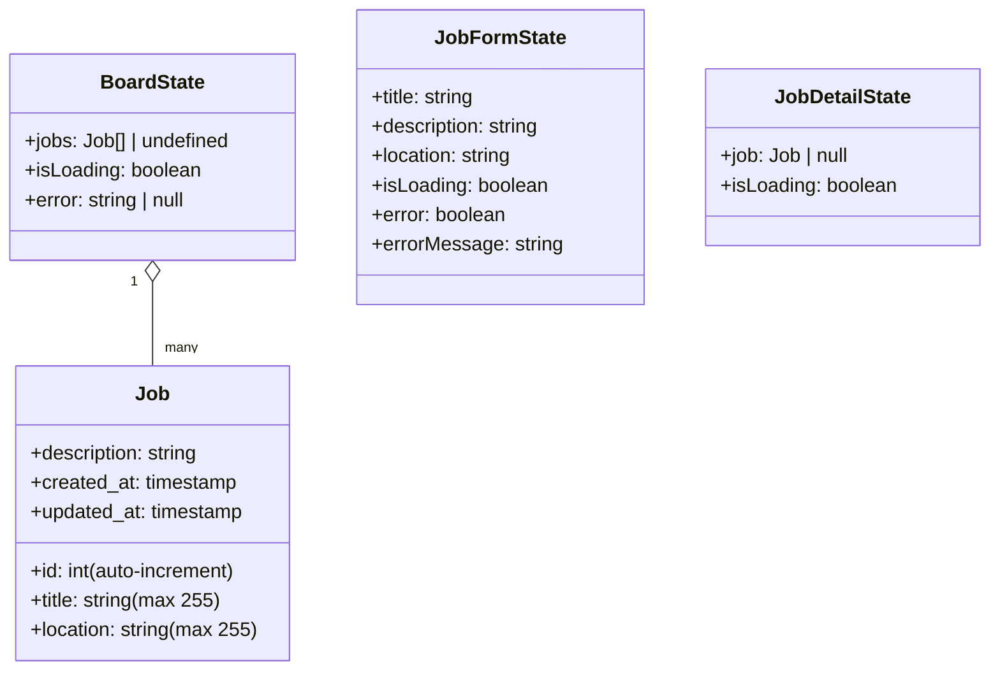
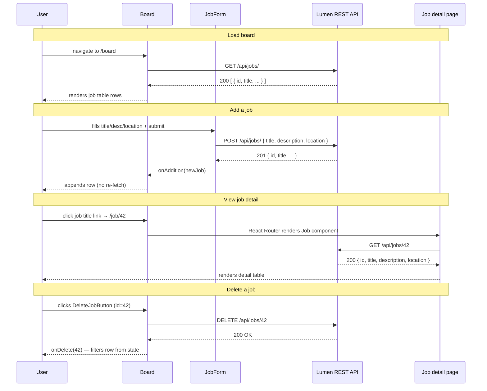

# React Lumen Job Board — Architecture

Tech stack: React 17 · React Router DOM v5 · Semantic UI React · Laravel Lumen · MySQL

---

## Application Flow Chart



---

## Data Model



---

## API Endpoints (Lumen Backend)

```mermaid
flowchart LR
    subgraph "READ"
        G1[GET /api/jobs/] --> idx[JobController@index\nReturn all jobs]
        G2[GET /api/jobs/:id] --> show[JobController@show\nReturn one job]
    end
    subgraph "WRITE"
        P1[POST /api/jobs/] --> create[JobController@create\nValidate + INSERT\nReturns 201]
        U1["PUT|PATCH /api/jobs/:id"] --> update[JobController@update\nPartial update\nReturns 200]
        D1[DELETE /api/jobs/:id] --> del[JobController@delete\nHard delete\nReturns 204]
    end
```

---

## Component Interaction Flow


